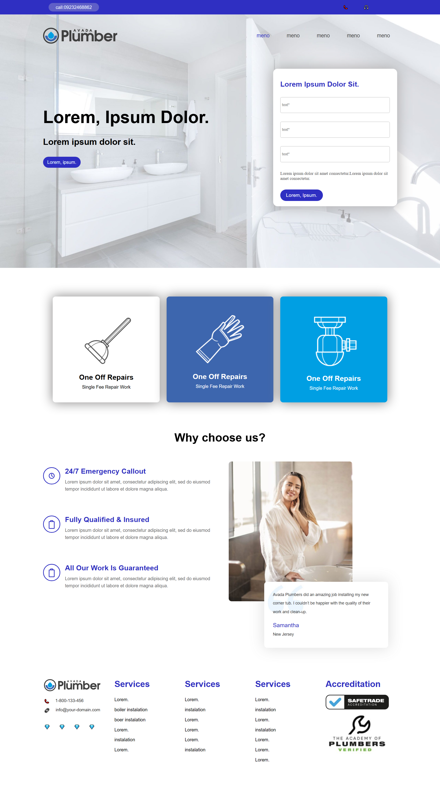

A responsive online store project. Live demo available at: https://eliiikhodayiii-png.github.io/first-project/

# My Project - Online Store

## Live Preview

Here is a preview of the live project:

You can visit the live site here: [Visit Live Site](https://eliiikhodayiii-png.github.io/first-project/)

---

## Features:
*   Responsive design for various screen sizes.
*   Clean and attractive UI.
*   (Add any other specific features you implemented, e.g., product display, navigation, etc.)

## Technologies Used:
*   HTML
*   CSS
*   JavaScript

## How to Use:
1.  Clone the repository.
2.  Open the `index.html` file in your browser.
